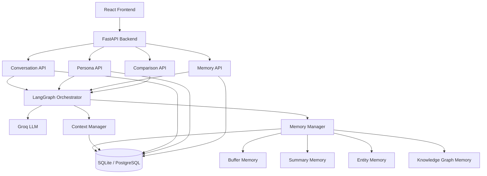
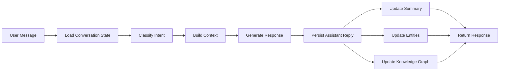

# Conversational AI Platform with Memory & LangGraph

A full-stack conversational AI platform that demonstrates persistent memory, multi-session context, knowledge persistence, and advanced conversation workflows using **LangGraph**, **FastAPI**, **React**, and **Groq**.

This project is based on the "Conversational AI with Memory & Chains" assignment, with the following stack changes:

- **LangGraph** instead of LangChain chains
- **FastAPI** instead of Flask
- **Groq** as the only LLM provider

## Overview

The goal of this project is to build a chatbot platform that can:

- remember conversation history across long chats
- preserve memory across browser refreshes and server restarts
- support multiple memory strategies per conversation
- track entities and relationships mentioned by the user
- manage context window limits intelligently
- allow multiple chatbot personas with different behaviors
- compare memory strategies on the same conversation

This project focuses on one of the hardest problems in production AI systems: **helping the assistant remember the right things at the right time without overflowing the context window**.

## Core Features

### Memory Types

The platform supports the following memory modes:

1. **Buffer Memory**
   Stores recent conversation history verbatim. Best for short conversations and maximum fidelity.

2. **Summary Memory**
   Periodically compresses older conversation history into a summary while keeping recent messages intact.

3. **Entity Memory**
   Extracts and stores important entities such as people, companies, projects, deadlines, technologies, and preferences.

4. **Knowledge Graph Memory**
   Extracts structured subject-predicate-object relationships and stores them as graph triples.

5. **Hybrid Memory**
   Combines summary memory and entity memory for better long-context performance.

### Conversation Capabilities

- multi-session conversations
- persona-based chat behavior
- persistent memory restoration
- context window optimization
- streaming assistant responses
- memory inspection dashboards
- knowledge graph visualization
- conversation export/import
- memory strategy comparison

## Why LangGraph

This project uses **LangGraph** to model conversation flow as explicit stateful graphs instead of relying on older chain abstractions.

LangGraph is a strong fit here because it allows:

- stateful conversation execution
- conditional routing
- parallel processing branches
- explicit memory update steps
- durable execution patterns
- cleaner orchestration for complex AI pipelines

Instead of building the app around deprecated memory helpers, this project implements the same memory concepts using **custom state + database persistence + graph nodes**.

## High-Level Architecture



## LangGraph Workflow Design

Each incoming user message passes through a graph-based workflow.

### Main Chat Graph



### Graph Design Goals

- **Sequential flow** for classification, context building, and response generation
- **Parallel updates** for summary, entities, and knowledge graph persistence
- **Conditional routing** based on user intent or memory strategy
- **Refinement loop** when a response misses important recalled facts

## Memory Strategy Design

### 1. Buffer Memory

**Purpose:** high-fidelity short-term conversation memory

**Behavior:**

- stores raw messages in order
- injects recent conversation into the prompt
- trims old messages when token budget is exceeded

**Best for:**

- short chats
- precise instruction-following
- debugging raw conversation flow

### 2. Summary Memory

**Purpose:** compress long conversations efficiently

**Behavior:**

- summarizes conversation every `N` messages
- replaces large chunks of old history with a concise summary
- keeps a configurable number of recent messages verbatim

**Best for:**

- long-running discussions
- project planning chats
- context retention under tight token budgets

### 3. Entity Memory

**Purpose:** track important facts over time

**Behavior:**

- extracts entities from user and assistant messages
- updates descriptions when new facts appear
- injects relevant entity context into future prompts
- supports conversation-level and optional cross-session entity recall

**Example:**

```json
{
  "John": "Backend developer working on Project Atlas, prefers Python and FastAPI",
  "Project Atlas": "Internal AI platform due on March 15, uses React frontend and PostgreSQL"
}
```

**Best for:**

- personal assistant behavior
- technical/project conversations
- preference tracking

### 4. Knowledge Graph Memory

**Purpose:** preserve structured relationships

**Behavior:**

- extracts triples such as `(John, works_on, Project Atlas)`
- stores graph relationships in the database
- retrieves related nodes/edges for prompt enrichment
- powers graph visualization in the UI

**Example triples:**

- `(John, works_on, Project Atlas)`
- `(Project Atlas, uses, React)`
- `(Project Atlas, deadline, March 15)`

**Best for:**

- research conversations
- organization structures
- character or concept relationship tracking

### 5. Hybrid Memory

**Purpose:** balance compression and fact retention

**Behavior:**

- uses summary memory for broad context
- uses entity memory for precise recall
- optionally auto-switches from buffer to hybrid after a message threshold

**Best for:**

- long and information-dense conversations
- business and project management personas

## Context Window Management

To avoid silent context overflow, the platform uses a **token budget manager**.

### Example Budget

- `500` tokens for system prompt
- `1000` tokens for summary/entity context
- `1500` tokens for recent messages
- `1000` tokens reserved for generation

### Context Handling Rules

- keep the latest user message at all costs
- preserve essential entity facts where possible
- summarize older messages when buffer usage grows too large
- progressively compress context if the limit is still exceeded
- expose token usage in the UI with a live progress bar

### Overflow Strategy

1. trim non-essential older raw messages
2. replace older history with summary
3. reduce entity detail length
4. keep only the most recent critical turns

## Personas

The platform includes built-in personas, each with a recommended memory strategy.

| Persona | Style | Recommended Memory |
|---|---|---|
| General Assistant | balanced, helpful, general-purpose | Summary |
| Code Helper | technical, precise, tracks files/functions/issues | Entity |
| Creative Writer | imaginative, narrative-aware | Knowledge Graph |
| Business Analyst | structured, formal, KPI-focused | Hybrid |
| Study Buddy | educational, concept-linking | Knowledge Graph + Summary |

Each persona includes:

- name
- avatar
- system prompt
- personality description
- default memory strategy
- temperature
- domain focus

## Persistence Model

All memory is persisted so the assistant can resume exactly where it left off.

### Stored Data

- conversations
- messages
- conversation summaries
- entity records
- entity history/timeline entries
- knowledge graph triples
- persona definitions
- token usage metadata
- comparison results

### Persistence Goals

- survive browser refresh
- survive backend restart
- restore full memory state on conversation reopen
- support export/import of memory state

## Suggested Project Structure

```text
conversational-ai-platform/
|
|-- backend/
|   |-- app/
|   |   |-- main.py
|   |   |-- core/
|   |   |   |-- config.py
|   |   |   |-- database.py
|   |   |   |-- dependencies.py
|   |   |-- api/
|   |   |   |-- routes/
|   |   |   |   |-- conversations.py
|   |   |   |   |-- personas.py
|   |   |   |   |-- memory.py
|   |   |   |   |-- compare.py
|   |   |   |   |-- export.py
|   |   |   |   |-- stats.py
|   |   |-- models/
|   |   |   |-- conversation.py
|   |   |   |-- message.py
|   |   |   |-- entity.py
|   |   |   |-- kg_triple.py
|   |   |   |-- persona.py
|   |   |   |-- summary.py
|   |   |-- schemas/
|   |   |   |-- conversation.py
|   |   |   |-- message.py
|   |   |   |-- persona.py
|   |   |   |-- memory.py
|   |   |-- services/
|   |   |   |-- groq_client.py
|   |   |   |-- token_counter.py
|   |   |   |-- context_manager.py
|   |   |   |-- memory_manager.py
|   |   |   |-- summary_memory.py
|   |   |   |-- entity_memory.py
|   |   |   |-- kg_memory.py
|   |   |   |-- hybrid_memory.py
|   |   |   |-- export_service.py
|   |   |-- graph/
|   |   |   |-- state.py
|   |   |   |-- builder.py
|   |   |   |-- nodes/
|   |   |   |   |-- load_state.py
|   |   |   |   |-- classify_intent.py
|   |   |   |   |-- build_context.py
|   |   |   |   |-- generate_response.py
|   |   |   |   |-- update_summary.py
|   |   |   |   |-- update_entities.py
|   |   |   |   |-- update_kg.py
|   |   |   |   |-- refine_response.py
|   |   |-- data/
|   |   |   |-- personas.json
|   |-- requirements.txt
|   |-- Dockerfile
|
|-- frontend/
|   |-- src/
|   |   |-- app/
|   |   |-- components/
|   |   |   |-- ChatWindow.tsx
|   |   |   |-- MessageBubble.tsx
|   |   |   |-- ConversationList.tsx
|   |   |   |-- PersonaSelector.tsx
|   |   |   |-- MemoryConfig.tsx
|   |   |   |-- EntityDashboard.tsx
|   |   |   |-- KnowledgeGraph.tsx
|   |   |   |-- TokenUsage.tsx
|   |   |   |-- MemoryComparison.tsx
|   |   |   |-- ExportPanel.tsx
|   |   |-- store/
|   |   |   |-- useConversationStore.ts
|   |   |   |-- usePersonaStore.ts
|   |   |-- lib/
|   |   |   |-- api.ts
|   |   |   |-- sse.ts
|   |   |-- types/
|   |   |-- pages/
|   |-- package.json
|
|-- .env.example
|-- README.md
```

## API Design

The backend follows a REST-first structure with streaming support for assistant replies.

### Conversation Endpoints

| Method | Endpoint | Description |
|---|---|---|
| POST | `/api/conversations` | Create a new conversation |
| GET | `/api/conversations` | List conversations |
| GET | `/api/conversations/{id}` | Get a conversation with messages and memory state |
| PUT | `/api/conversations/{id}` | Rename, pin, archive, or update settings |
| DELETE | `/api/conversations/{id}` | Delete a conversation |
| POST | `/api/conversations/{id}/message` | Send a user message and stream AI response |

### Memory Endpoints

| Method | Endpoint | Description |
|---|---|---|
| GET | `/api/conversations/{id}/entities` | Get entity memory state |
| GET | `/api/conversations/{id}/graph` | Get knowledge graph triples |
| GET | `/api/conversations/{id}/summary` | Get conversation summary |
| GET | `/api/conversations/{id}/tokens` | Get token usage breakdown |
| GET | `/api/entities/search` | Search entities across conversations |

### Persona Endpoints

| Method | Endpoint | Description |
|---|---|---|
| GET | `/api/personas` | List personas |
| POST | `/api/personas` | Create persona |
| GET | `/api/personas/{id}` | Get persona |
| PUT | `/api/personas/{id}` | Update persona |
| DELETE | `/api/personas/{id}` | Delete persona |

### Utility Endpoints

| Method | Endpoint | Description |
|---|---|---|
| POST | `/api/conversations/{id}/export` | Export conversation memory |
| POST | `/api/conversations/import` | Import conversation memory |
| POST | `/api/compare/memory` | Compare two memory strategies |
| GET | `/api/stats` | Memory statistics |
| GET | `/api/health` | Health check |

## Frontend Experience

### Main Chat Screen

- left sidebar with conversation list and search
- center chat panel with markdown-rendered messages
- top bar with active persona and memory strategy
- bottom composer with send box and status
- right memory inspector with tabs:
  - entities
  - knowledge graph
  - summary
  - token usage

### Additional Views

- persona manager
- entity dashboard
- knowledge graph visualization
- memory comparison screen
- token analytics and memory stats

## Database Design

Expected core tables:

- `conversations`
- `messages`
- `personas`
- `conversation_summaries`
- `entities`
- `entity_versions`
- `kg_triples`
- `token_usage_logs`
- `memory_comparisons`

## Groq Integration

This project uses **Groq only** for:

- assistant response generation
- summary generation
- entity extraction
- triple extraction
- optional intent classification

Groq is selected for its fast inference speed, which is especially useful for:

- multi-step graph workflows
- real-time chat UX
- summary and extraction side tasks
- streaming response generation

## Environment Variables

Create a `.env` file in the backend directory based on `.env.example`.

### Example

```env
GROQ_API_KEY=your_groq_api_key
GROQ_MODEL=llama-3.3-70b-versatile
DATABASE_URL=sqlite:///./memory_chat.db
FRONTEND_URL=http://localhost:5173
APP_ENV=development
LOG_LEVEL=info
SECRET_KEY=change_me
TOKEN_BUDGET_TOTAL=4000
TOKEN_BUDGET_SYSTEM=500
TOKEN_BUDGET_MEMORY=1000
TOKEN_BUDGET_RECENT=1500
TOKEN_BUDGET_RESPONSE=1000
SUMMARY_INTERVAL=5
MAX_RECENT_MESSAGES=10
AUTO_SWITCH_THRESHOLD=15
```

## Local Development Setup

### Backend

```bash
cd backend
python -m venv .venv
source .venv/bin/activate
pip install -r requirements.txt
uvicorn app.main:app --reload
```

For Windows PowerShell:

```powershell
cd backend
python -m venv .venv
.venv\Scripts\Activate.ps1
pip install -r requirements.txt
uvicorn app.main:app --reload
```

### Frontend

```bash
cd frontend
npm install
npm run dev
```

## Suggested Backend Dependencies

```txt
fastapi
uvicorn
sqlalchemy
alembic
pydantic
python-dotenv
httpx
langgraph
langchain-core
groq
tiktoken
sse-starlette
python-multipart
orjson
```

## Suggested Frontend Dependencies

```txt
react
typescript
vite
tailwindcss
zustand
react-markdown
react-force-graph
recharts
axios
```

## Implementation Plan

### Phase 1

- set up FastAPI project
- configure database models and migrations
- implement conversation CRUD
- build Groq client
- create buffer and summary memory
- build token budget manager

### Phase 2

- implement entity extraction and storage
- implement knowledge graph triple extraction
- build LangGraph conversation workflow
- support persona-aware prompting
- restore memory state per conversation

### Phase 3

- build React chat UI
- add streaming responses
- add entity dashboard
- add knowledge graph visualization
- add token usage inspector

### Phase 4

- implement hybrid memory
- implement memory comparison tool
- add export/import
- polish UX and documentation

## Evaluation Mapping

This project is designed to satisfy the assignment goals in the adapted stack:

| Assignment Area | This Project Approach |
|---|---|
| LangChain memory types | Recreated using LangGraph state + custom memory services |
| Chains architecture | Implemented as LangGraph node/edge workflows |
| Flask backend | Replaced by FastAPI |
| LLM provider flexibility | Simplified to Groq only |
| Persistence | SQLAlchemy with SQLite/PostgreSQL |
| Knowledge visibility | Entity dashboard + graph visualization |
| Context optimization | Token budget manager + summarization strategy |

## Key Design Decisions

### 1. LangGraph over old chain abstractions

This makes the workflow more explicit, easier to debug, and better aligned with modern orchestration patterns.

### 2. Custom memory services over deprecated memory classes

Instead of coupling the app to older helper classes, memory is implemented as durable application logic backed by the database.

### 3. Groq-only provider strategy

Using a single provider simplifies configuration, testing, and deployment while still delivering fast responses.

### 4. Persistent-first architecture

The system treats memory as application data, not temporary prompt state.

## Future Enhancements

- cross-conversation entity memory
- smarter domain-specific summarization
- conversation forking
- persona import/export
- PDF export
- evaluation scoring for memory quality
- automated replay benchmarks for memory comparison
- Docker and CI/CD support

## Expected Outcome

By the end of this project, the platform should allow a user to:

- create a conversation with a chosen persona
- talk over many turns without losing important context
- reopen the same conversation later and continue seamlessly
- inspect what the AI remembers as entities and relationships
- compare how different memory strategies affect response quality

## Demo Scenarios

### Scenario 1: Long Project Discussion

The user discusses a software project over dozens of messages. Summary memory compresses earlier discussion while entity memory preserves facts such as deadlines, team members, and technology choices.

### Scenario 2: Personal Preference Recall

The user states preferences like preferred programming languages, frameworks, and working style. Entity memory retrieves these later without needing repetition.

### Scenario 3: Organization Graph Building

The user explains reporting structures, project ownership, and business relationships. Knowledge graph memory stores these connections and displays them visually.

## README Notes

This README is intentionally written for the adapted implementation:

- **FastAPI** replaces Flask
- **LangGraph** replaces classic LangChain chain orchestration
- **Groq** is the only model provider

If LangChain helper memory classes are deprecated, their behaviors will be implemented manually using:

- LangGraph state
- prompt construction layers
- SQLAlchemy persistence
- custom extraction/update services

